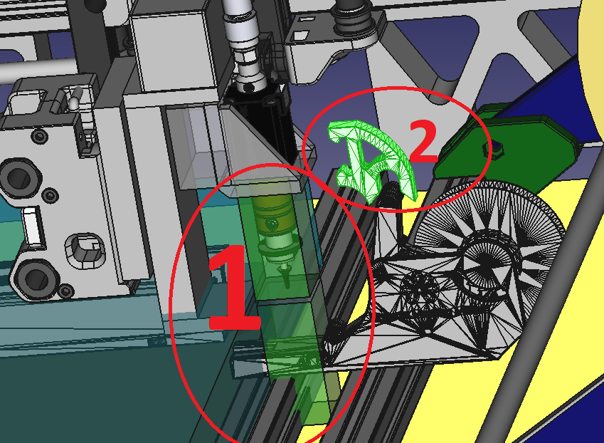
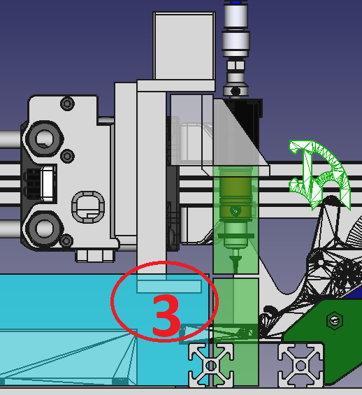
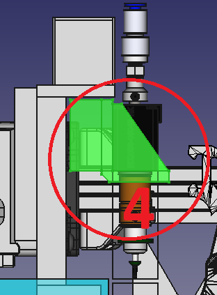
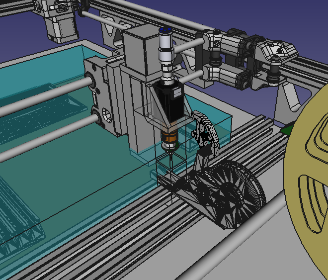
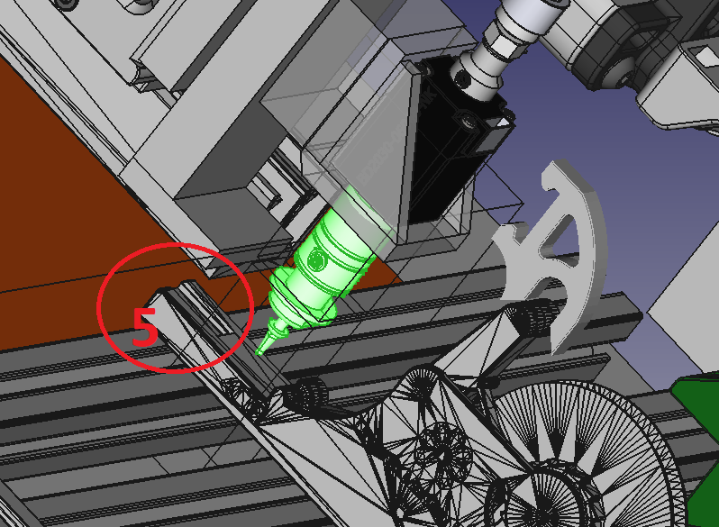

... for a first pass.

Figure

Item 1 of Figure 1 shows two boxes which are the JUKI feeder nozzle extent at either the top most or bottom most reach of the 50mm range of the Z-Axis. Item 2 is the lever actuator used to increment the tape using the pushpullfeeder.

The lever actuator will actually want to sit higher at full up position to clear the lever on the feed as the head moves towards it. So that can be sorted of course. I have just put 5mm packing behind the Z-Axis and will need add the look down camera position in any event, probably to that Z-Axis mount.

Figure 2

Item 3 of Figure 2 shows the dosh gunnit dang blaste incursion into the sacred 310x310x50mm zone. Not a problem, I just need to redesign the widget holding the JUKI feeder at Item 4 in Figure 3. Really, jacking the Z-Axis gantry up a tad as well. The great thing is that all things seem to fall into place BUT with the overhang the Y axis will mean while the range of motion will be 310x310, the actual working space will be (310 minus some over hang)x310. Probably in the order of 45mm. So 265x310 working area. Obviously, you can add another 50mm or even 100mm or more by just adjusting your Y axis size in the VORON-Legacy configurator.

Figure 4

So some BRILLIANT designing, or pure arse luck LOL. So, first pass looks like that in Figure 5.

Figure 5

I guess I did also deliberately over-reach for the lever, so that when lined up with the tap holes, the lever actuator should clear the feeder as in Figure 6. Since, the nozzle would pick up the chips highlighted by Item 5 of Figure 6.

Figure 6

So close. I so want to build this sucker. It will be over a 12 month period, buying the parts in dribs and drabs as usual.

Have to finish the design. The Z-Axis and the JUKI smt NEMA8 motor are already coming, so the dribs are on their way.
