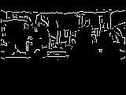

2.8mm lens

6mm lens

So, as I expected. A lens change, with a narrower FOV, "zoomed" into the image to better fill out the sensor realestate.

Focusing now seems really straight forward as I worked out I can set the focus of the lens and then pop the 360o lens, rather than try focusing via the 360o lens.

Next step, play!

Found an example that included a linear polar conversion. Hmmm.

HOLLY HELL!

Who needs to write code?!

As simple as:

`img = sensor.snapshot().linpolar(reverse=False)`

AND, a little twisting of the 360o lens (probably to move the centre of the image to the centre of the sensor).

As a check I carefully took off the bloggie leans, and then re-ran the hello-world, and here is!

Not quite centred but close.

So, less work to play with looking at means to do obstacle avoidance. Based upon the [roborealm example](http://www.roborealm.com/tutorial/Obstacle_Avoidance/slide010.php), here is a first attempt using canny edge detection, with the thresholds from the tutorial page.

Canny edges

Really simple, with:

`img = sensor.snapshot().linpolar(reverse=False).find_edges(image.EDGE_CANNY,threshold=(50,80))`

Needs more playing, but a start. Obviously, me desk may, I say may, be somewhat too cluttered. Out on the lawn, with an expanse of green, may be a better proposition.

Although, canny edges over the starting image may also be useful. At least to, say, run find\_circles and so help programmatically find centre. Can't use the centre (x,y) at the moment. Waiting on update of `lin_polar()` to take centre input.

Polar canny edges

Or you can find [someone has already done it](https://forums.openmv.io/t/obstacle-detection-and-avoidance/250/7), and hence.

https://www.youtube.com/watch?v=YM0-TqY3v5o

Each vertical should now be seen as a radial plot in 360 degrees, range from bottom to top, centre top is looking forward (range from bottom)
